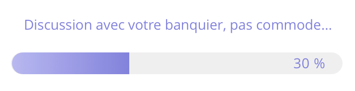

# Exomind Test Technique

Test technique réalisé avec Flutter 2.10.5 pour Exomind.

## Sujet

Créer une application qui : 
 
Affiche un écran d’accueil avec un texte et un bouton.
Au clic sur le bouton, j’arrive sur un autre écran contenant une jauge de progression en pourcentage en bas de l’écran avec un message au dessus.
Par exemple : 

 
Cette jauge doit se remplir à 100% en 60 secondes
Toutes les 10 secondes elle doit faire un appel à une API météo pour 5 villes : 
0 secondes Rennes, à 10 secondes Paris, à 20 secondes Nantes, etc pour Bordeaux et Lyon
(par exemple l’api <a href='https://openweathermap.org/current'>OpenWeatherMap</a>, ou une autre API de météo de votre choix)
Un message d’attente est affiché pour faire patienter l’utilisateur
3 messages qui doivent tourner toutes les 6 secondes (sans limite de temps)
1.    Nous téléchargeons les données…
2.    C’est presque fini…
3.    Plus que quelques secondes avant d’avoir le résultat…
 
Gérer les erreurs d’API
Lorsque la jauge est remplie elle affiche les résultats obtenus sous forme d’un tableau de 5 lignes (une ligne par ville) sur le même écran (au-dessus de la jauge par exemple)
Afficher à minima le nom de la ville, la température, la couverture nuageuse (sous forme d’un picto par exemple)
La jauge se transforme en bouton « Recommencer »
Il est possible de faire back pour revenir à l’écran d’accueil